# 紙芝居形式の初回設定（PC版0.4.0）

初回起動で「初回設定ガイド」が開きます。このページでは、**スクリーンショットを見ながら、押すボタンを一つずつ確認**できます。

すでに「このGoogleアカウントで利用します」と表示されている方は、[Googleアカウントの確認](#googleアカウントの確認)へ進んでください。Cloudの準備をやり直す必要はありません。

以下はPC版0.4.0のガイド画面を、同じHTML・CSS・JavaScriptからPlaywrightで撮影したものです。プロジェクトIDとURLは説明用の値です。途中の画面は撮影用の再開データで表示しており、Google Cloudへの設置成功を示すものではありません。**画面内のGoogle設定の図は説明用の再現図で、Googleサイト自体のスクリーンショットではありません。** 最後のアカウント確認画像は、利用者から提供されたPC画面です。

## はじめの画面で選ぶ

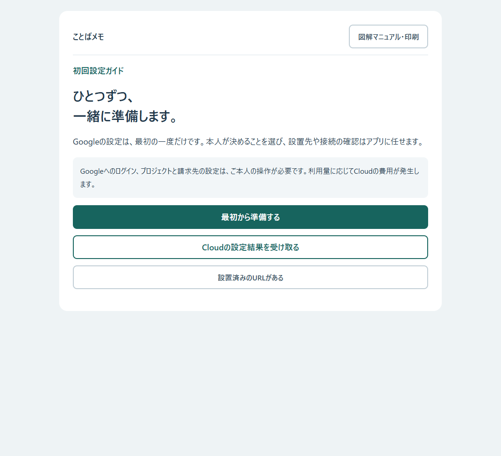

| 今の状態 | クリックするボタン |
| --- | --- |
| これから初めて設置する | **最初から準備する** |
| 自分のCloudに設置したアプリURLがある | **設置済みのURLがある** |
| Cloud Shellから設定結果ファイルをダウンロードした | **Cloudの設定結果を受け取る** |
| 前回の続きから進めたい | **続きから再開する**（記録があると表示されます） |

### 設置済みのURLがある場合

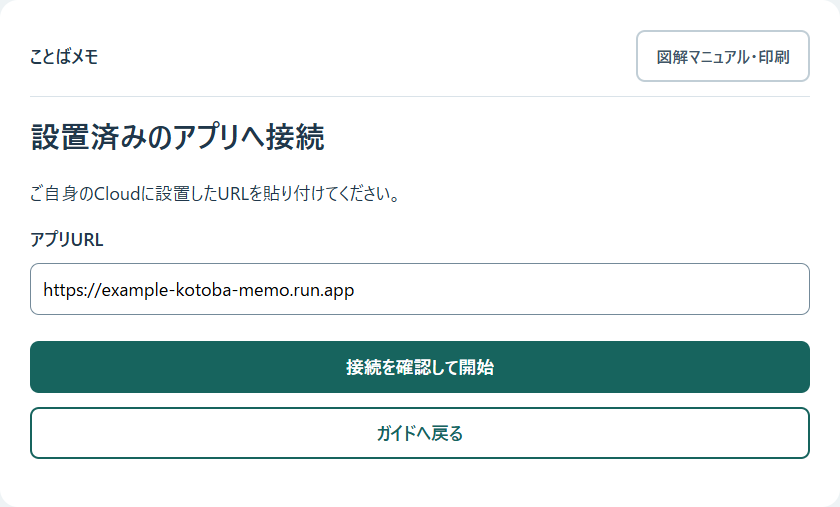

1. 「アプリURL」欄をクリックし、**ご自身の設置先URL**を貼り付けます。画像内のURLは説明用です。
2. **「接続を確認して開始」**をクリックします。
3. ログイン画面が開いたら、[Googleアカウントの確認](#googleアカウントの確認)へ進みます。

## 初めて設置する：12画面の手順

Googleの設定ページで操作した後は、ことばメモのガイドへ戻ります。確認欄がある画面では、作業が終わってからクリックしてチェックを付け、**「次へ」**をクリックします。

コピーは画面のボタンを使います。貼り付けは、入力欄を右クリックして「貼り付け」を選ぶ方法で進められます。Cloud Shellのメニューが異なる場合は、その画面の貼り付け項目を使ってください。命令の実行にはEnterキーを1回押します。キーボードを使いにくい場合は、Windowsの「設定 → アクセシビリティ → キーボード」でスクリーンキーボードを開き、Enterをクリックできます。

### 1 / 12：自分のプロジェクトを選ぶ

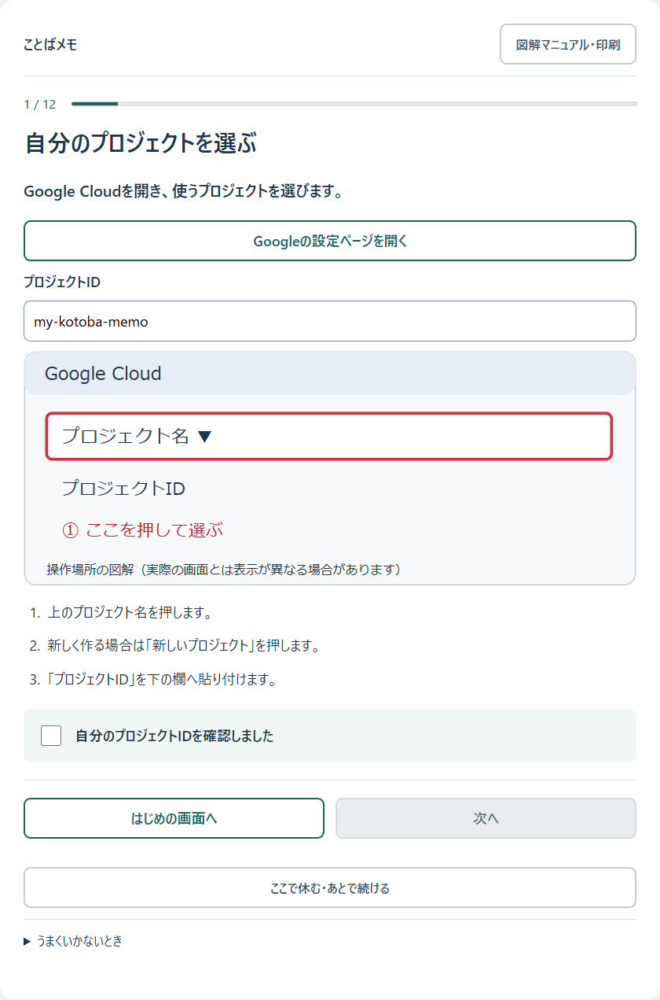

1. **「Googleの設定ページを開く」**をクリックします。
2. Google Cloudで使うプロジェクトを選び、プロジェクトIDをコピーします。
3. ガイドに戻り、「プロジェクトID」欄へ貼り付けます。
4. 「自分のプロジェクトIDを確認しました」にチェックを付け、「次へ」をクリックします。

ここで入力するのは、Google CloudのプロジェクトIDです。Googleアカウントのメールアドレスや、クライアントIDとは別のものです。

### 2 / 12：請求先を確認する

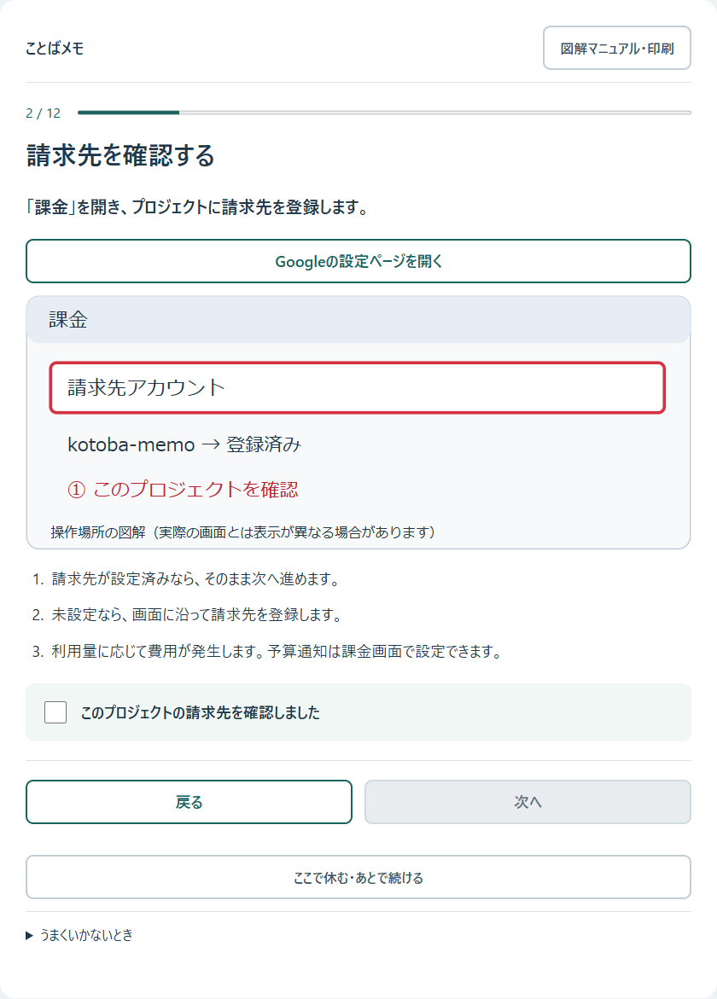

1. **「Googleの設定ページを開く」**をクリックします。
2. 選んだプロジェクトの請求先を確認します。未設定ならGoogleの画面に沿って登録します。
3. ガイドに戻り、「このプロジェクトの請求先を確認しました」にチェックを付け、「次へ」をクリックします。

Cloudの利用量に応じて費用が発生します。

### 3 / 12：設置を準備する

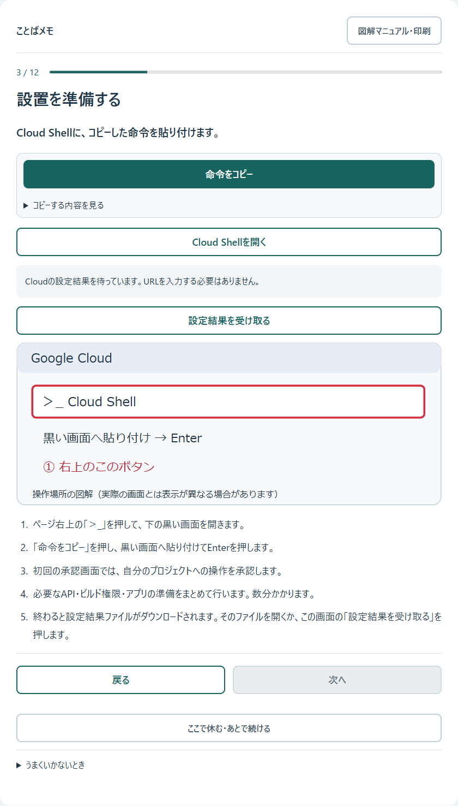

1. **「命令をコピー」**をクリックします。
2. **「Cloud Shellを開く」**をクリックします。
3. 黒い画面へ命令を貼り付け、Enterを1回押します。初回の承認が出たら内容を確認して承認します。
4. 完了してダウンロードされた設定結果ファイルを開きます。ガイドの **「設定結果を受け取る」**からファイルを選ぶこともできます。

準備には数分かかります。「次へ」は、準備結果を受け取るまで押せません。

### 4 / 12：設置先を自動で確認する

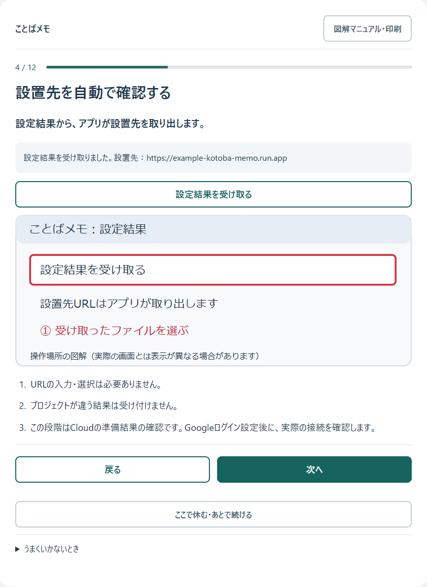

設置先URLは、設定結果ファイルから自動で取り出します。URLを探して入力する必要はありません。準備結果を受け取ると、通常は次の「アプリの名前を設定する」へ自動で進みます。戻ってこの画面を開いた場合は、表示された設置先を確認して「次へ」をクリックします。

この時点では準備結果の確認です。Googleログインの接続確認は最後に行います。

### 5 / 12：アプリの名前を設定する

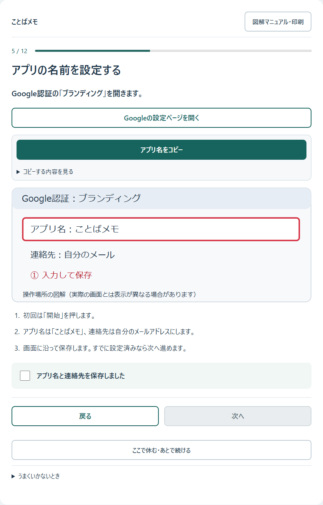

1. **「Googleの設定ページを開く」**をクリックし、Google認証の「ブランディング」を開きます。
2. 初回は「開始」をクリックします。アプリ名は **「アプリ名をコピー」**でコピーした「ことばメモ」を使い、連絡先は自分のメールアドレスにします。
3. Googleの画面で保存します。ガイドに戻り、保存確認にチェックを付けて「次へ」をクリックします。

### 6 / 12：自分をテストユーザーに登録する

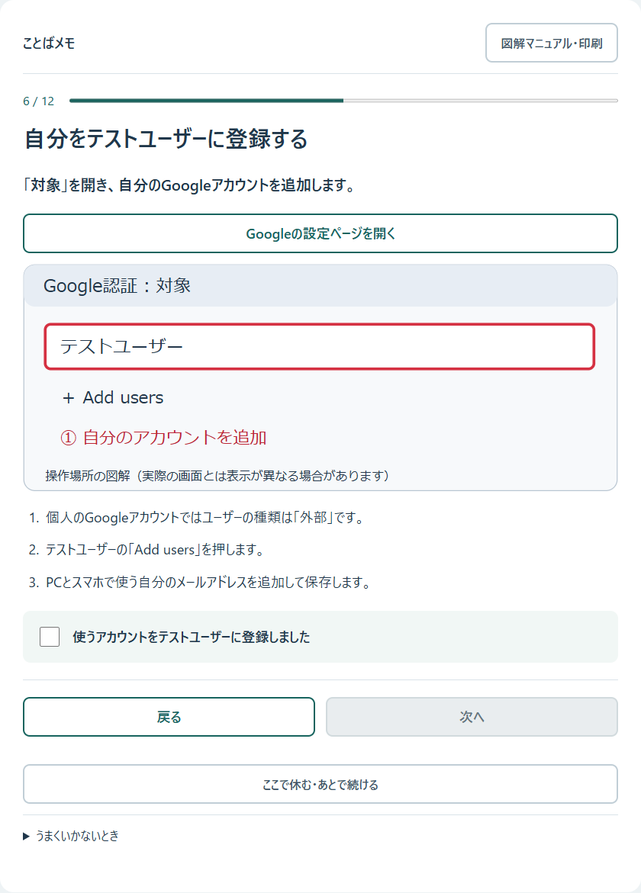

1. **「Googleの設定ページを開く」**をクリックし、「対象」を開きます。
2. 個人のGoogleアカウントでは「外部」を選び、テストユーザーの「Add users」をクリックします。
3. **PCとスマホで使うGoogleアカウントのメールアドレス**を追加して保存します。
4. ガイドに戻り、登録確認にチェックを付けて「次へ」をクリックします。

### 7 / 12：Driveの保存権限を選ぶ

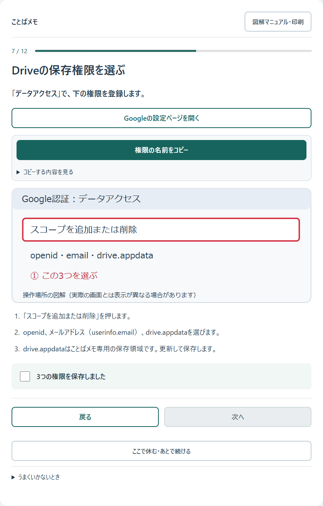

1. **「Googleの設定ページを開く」**をクリックし、「データアクセス」を開きます。
2. 「スコープを追加または削除」で、openid・メールアドレス（userinfo.email）・drive.appdataを選び、更新して保存します。
3. drive.appdataの名前は **「権限の名前をコピー」**でコピーできます。
4. ガイドに戻り、保存確認にチェックを付けて「次へ」をクリックします。

drive.appdataは、ことばメモ専用の保存領域を使うための権限です。

### 8 / 12：Googleログインの設定を作る

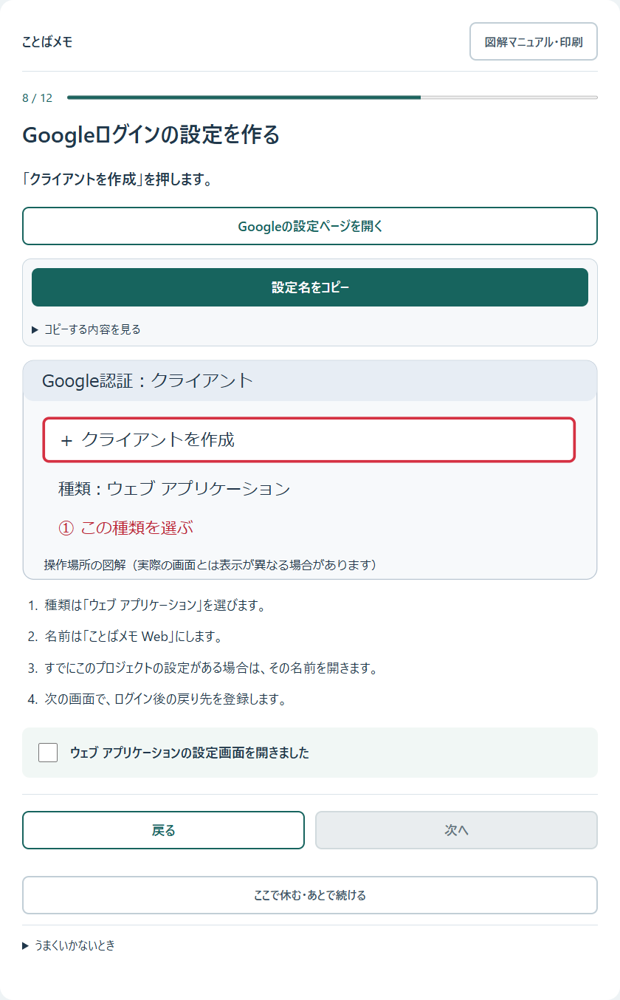

1. **「Googleの設定ページを開く」**をクリックし、「クライアントを作成」を選びます。
2. 種類は「ウェブ アプリケーション」、名前は「ことばメモ Web」にします。名前は **「設定名をコピー」**でコピーできます。
3. すでに設定がある場合は、その設定を開きます。
4. ガイドに戻り、設定画面を開いた確認にチェックを付けて「次へ」をクリックします。戻り先URLは次の手順で登録します。

### 9 / 12：ログイン後の戻り先を登録する

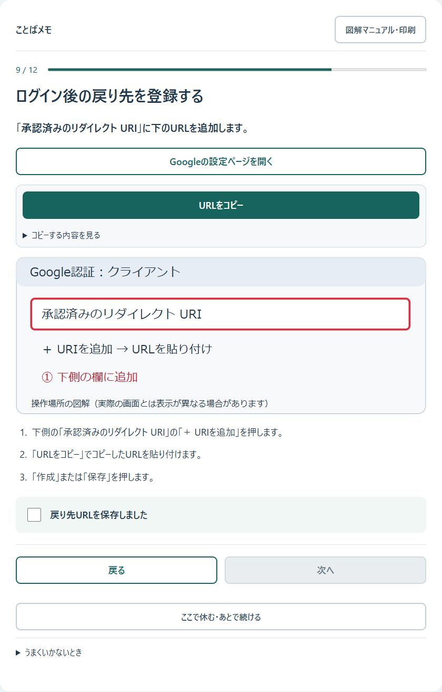

1. **「URLをコピー」**をクリックします。
2. Googleのクライアント設定で、下側の「承認済みのリダイレクト URI」の「＋ URIを追加」をクリックし、コピーしたURLを貼り付けます。
3. Googleの画面で「作成」または「保存」をクリックします。
4. ガイドに戻り、保存確認にチェックを付けて「次へ」をクリックします。

画像のURLを手入力せず、ご自身のガイドの「URLをコピー」を使ってください。

### 10 / 12：ログインの値をCloudへ保存する

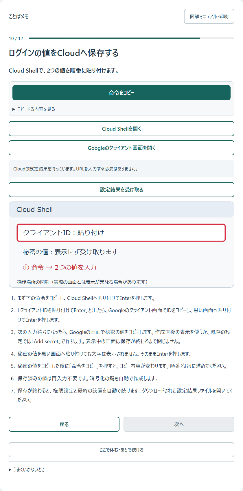

1. **まず「命令をコピー」**をクリックします。「Cloud Shellを開く」で黒い画面を開き、命令を貼り付けてEnterを1回押します。
2. 「クライアントIDを貼り付けてEnter」と表示されたら、**「Googleのクライアント画面を開く」**でIDをコピーし、Cloud Shellへ貼り付けてEnterを1回押します。
3. 次の入力待ちで、Googleの画面から秘密の値をコピーします。作成直後の表示を使うか、既存の設定では「Add secret」で作ります。
4. Cloud Shellへ秘密の値を貼り付け、Enterを1回押します。**文字が表示されなくても、そのまま進めます。**
5. 保存と最終設置が終わったら、ダウンロードされた設定結果ファイルを開きます。

秘密の値をコピーした後に「命令をコピー」を押すと、コピー内容が置き換わります。この順番で進めてください。秘密の値はガイドへ入力せず、表示中のGoogle画面は保存が終わるまで閉じません。保存済みの値は再入力不要です。

### 11 / 12：設置と接続を自動で確認する

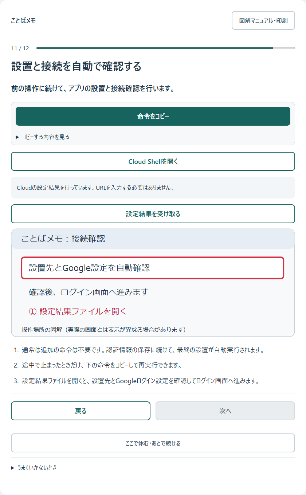

通常は、前の操作から自動で最終設置へ進みます。途中で止まったときだけ、**「命令をコピー」**で再実行用の命令をCloud Shellに貼り付け、Enterを1回押します。

完了した設定結果ファイルを開くと、設置先とGoogleログイン設定を確認し、ログイン画面へ進みます。ファイルを開けない場合は **「設定結果を受け取る」**から選びます。

### 12 / 12：ことばメモへ接続する

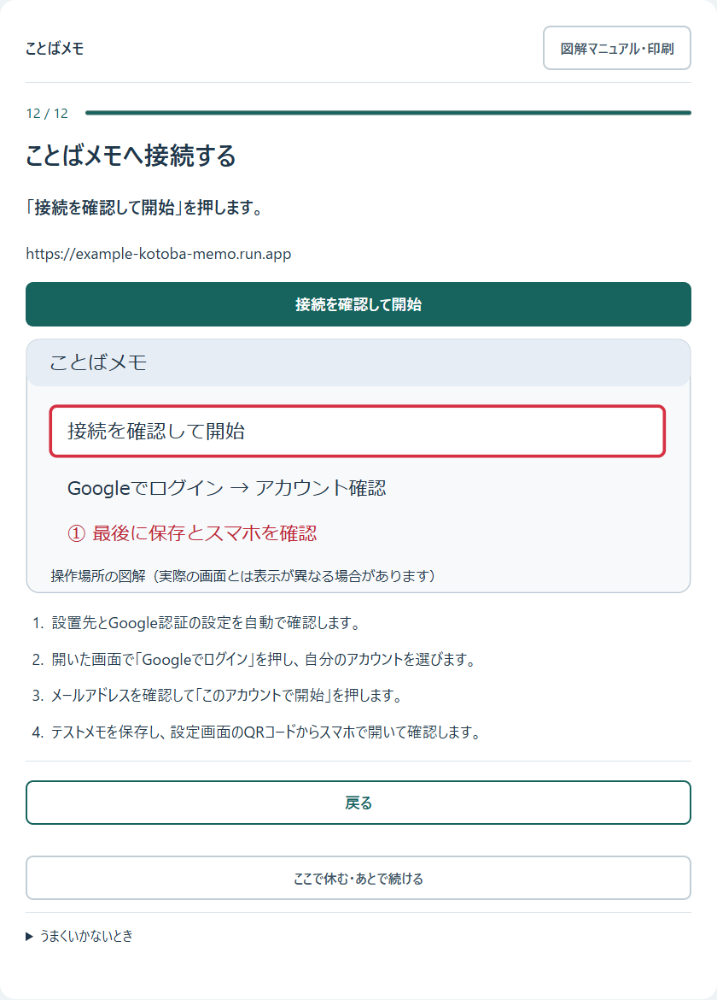

**「接続を確認して開始」**をクリックします。接続確認が成功したら、次のGoogleアカウント確認へ進みます。最終結果の受け取り後にログイン画面へ自動で進んだ場合は、このボタンを押し直す必要はありません。

## Googleアカウントの確認

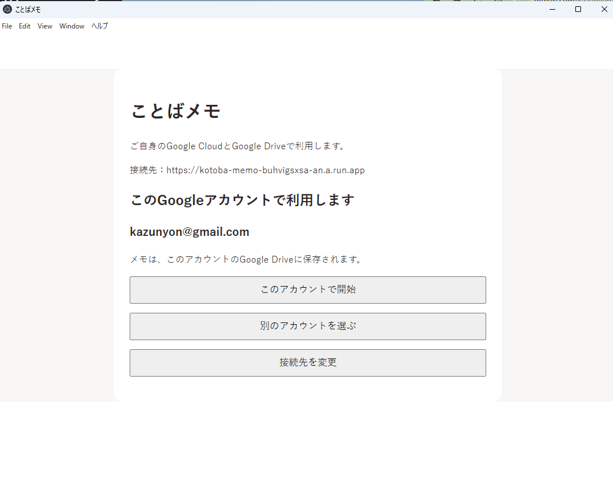

画像のメールアドレスと接続先は撮影時のものです。**ご自身の画面に表示されたメールアドレス**を確認してください。

1. まだメールアドレスが出ていなければ、「Googleでログイン」をクリックし、開いたブラウザで使うGoogleアカウントを選びます。終わったらことばメモへ戻ります。
2. 太字のメールアドレスが、メモを保存したいGoogleアカウントか確認します。
3. 正しければ **「このアカウントで開始」**をクリックします。違う場合は **「別のアカウントを選ぶ」**をクリックして選び直します。未送信データの削除確認が出た場合はキャンセルし、現在のアカウントで開始して先にバックアップします。
4. テスト用メモを保存します。PCの「設定 → スマホでも使う」のQRコードをスマホで読み、同じGoogleアカウントでログインして、そのメモが表示されるか確認します。

Googleとの紐づけ（Google_ID）は、このメールアドレスを目印に確認します。この画面でGoogle_IDの入力は不要です。初回設定のクライアントIDとは別のものです。「接続先を変更」は設置先URLを変えるためのボタンです。

## 途中で休む・再開する

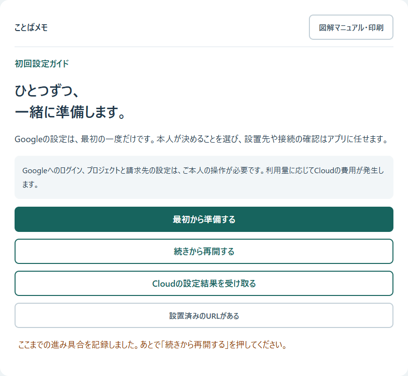

1. 作業途中の画面で **「ここで休む・あとで続ける」**をクリックします。
2. 進み具合を記録したメッセージが出たことを確認します。
3. 次回は **「続きから再開する」**をクリックします。

## 紙で見たいとき

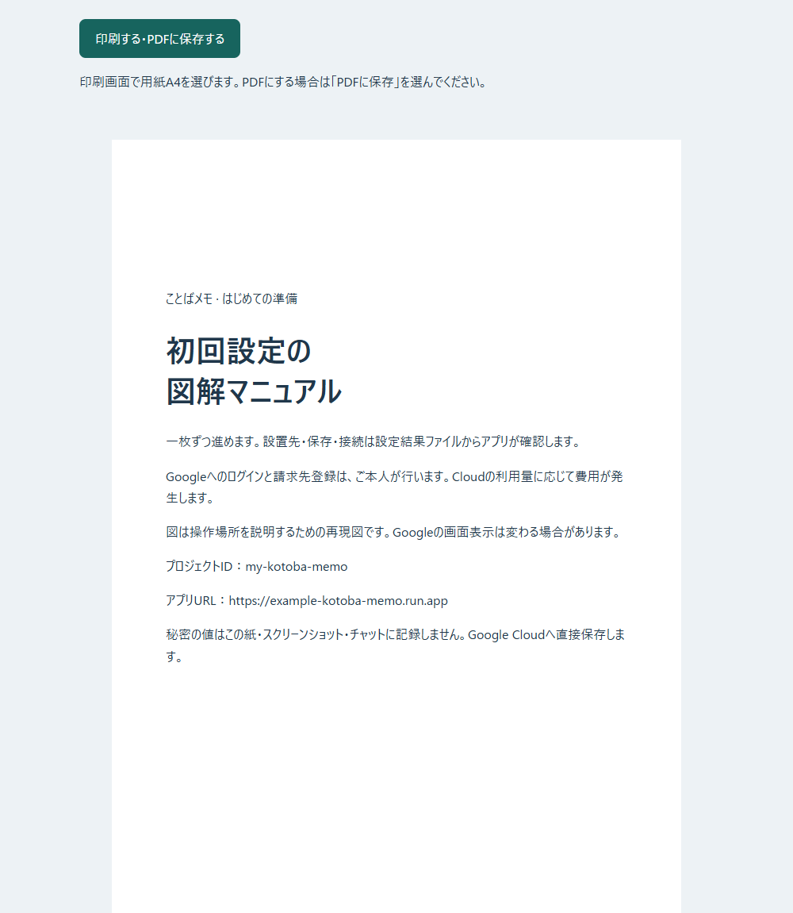

1. ガイド右上の **「図解マニュアル・印刷」**をクリックします。
2. 開いたマニュアルの **「印刷する・PDFに保存する」**をクリックします。
3. 印刷画面でプリンター、またはPDF保存を選びます。

## 設定の仕組み・詳しい説明

## 利用者の操作

- 「最初から準備する」で開始し、自分のGoogle CloudプロジェクトIDを貼り付けます。
- 「Googleの設定ページを開く」「Cloud Shellを開く」で、選んだプロジェクトの該当ページを開きます。
- 長い命令を手入力せず「命令をコピー」で貼り付けます。内容は必要な場合だけ展開して確認できます。
- 本人がGoogle画面で行う同意・請求先等は確認して「次へ」を押します。Cloudの準備・認証情報保存・最終設置には手動の完了チェックを使いません。
- 「ここで休む」で進み具合を保存し、次回「続きから再開する」を押します。
- 設置済みなら「設置済みのURLがある」で直接接続できます。
- 設置後も、アプリの「ヘルプ → 初回設定ガイドを開く」でガイドへ戻れます。編集中のメモは先に保存してください。

最後の接続確認では実際の`/api/config`を読み、設置先originとGoogleクライアント設定を確認します。その後のログイン・アカウント確認・保存・スマホでの表示は、本人の端末で確認します。ガイドの確認チェックだけで実機同期の成功とは判定しません。

## できるだけ自動にした部分

Cloud Shellで次の3種類の命令を実行します。プロジェクトIDを入れた命令はガイドが作ります。

1. `setup.sh prepare`：必要なAPI、アプリ用アカウント、専用ビルドアカウントと`roles/run.builder`、準備サービスを設定。混雑や権限反映待ちは回数を制限して再試行します。
2. `setup.sh credentials`：クライアントIDと秘密の値を、入力待ちに合わせて貼り付けます。Secret Managerの作成とバージョン確認、32バイトの暗号化キー生成をまとめ、最終設置へ自動で進みます。
3. `setup.sh finish`（通常は自動、失敗後の再開にも利用）：3つの有効な秘密情報を確認し、アプリ用アカウントへその3つだけの参照権限を付け、設定済みのCloud Runを設置します。

課金登録、Google認証のブランディング・対象ユーザー・権限・クライアント作成は、本人がGoogleの画面で行います。Cloud Shellの初回認証も本人の操作です。費用は本人のプロジェクトへ発生します。

## 秘密の値の扱い

秘密の値はガイドへ入力しません。まず命令を実行し、クライアントIDの入力待ちにIDを貼り付けます。次の入力待ちで、Googleからコピーした秘密の値を貼り付けます。文字は画面へ表示されません。命令履歴に秘密の値を入れません。

秘密の値をコピーした後に「命令をコピー」を押すと、コピー内容が置き換わるため、順番を図解しています。新しい秘密の値の表示画面は保存が終わるまで閉じません。秘密の値をスクリーンショット、チャット、紙へ記録する必要はありません。

保存済みの有効な秘密情報は再入力せず、既存のセッション暗号化キーも保持します。変更したOAuthクライアントへ移行する操作や、鍵のローテーションはこの初回設定とは別に管理します。秘密の値を紛失した場合はGoogleのクライアント画面で再発行が必要です。追加上限や利用中の秘密情報の扱いは管理者へ確認してください。

## 印刷用マニュアル

「図解マニュアル・印刷」を押すと、ガイドと同じ図解の14ページを表示します。印刷画面でA4またはPDF保存を選びます。入力済みのプロジェクトIDと設置先URLを差し込めます。秘密の値は含みません。

ソースでは `desktop/setup-manual.html` を開けます。説明文・URL・コピー内容は`desktop/setup-guide.js`、図は`desktop/setup-diagram.js`を共通利用しています。

## エラーの案内

「うまくいかないとき」へエラー結果を貼り付けると、混雑・操作権限・秘密情報の保存漏れ・請求先に分け、該当手順へ戻るボタンを表示します。エラー結果は保存しません。判別できないエラーでは原因を断定せず、管理者への相談を案内します。

## 設定結果の自動受け取り

Cloudの準備と最終設置の成功後に `kotoba-プロジェクトID-prepare.kotoba-setup` または `kotoba-プロジェクトID-finish.kotoba-setup` を作り、Cloud Shellのダウンロードを呼び出します。ファイルの内容はバージョン、プロジェクトID、段階、canonical Cloud Run URLのみで、認証情報は含みません。

Windowsではこの拡張子をことばメモに関連付けます。ダウンロードしたファイルを開くとアプリが受け取ります。関連付けを利用できない場合は、PCガイドの「設定結果を受け取る」でそのファイルを選びます。Cloud Shellの自動ダウンロードが使えない場合は、表示されたファイルをCloud Shellのファイル一覧から取得します。URLを探したり選んだりする必要はありません。

アプリはファイルサイズ・形式・HTTPS Cloud Run URL・選択済みプロジェクト・準備済みURLの一致を検査します。準備結果から設置先とリダイレクトURIを自動生成し、Google同意設定へ進みます。最終結果では実際の `/api/config` を読み、設定済みフラグ・origin・WebクライアントIDを確認してログイン画面へ進みます。接続に失敗した場合は完了扱いにせず、結果を再選択できます。

結果ファイル自体は署名付きGoogle証明ではありません。準備結果はCloudスクリプトの成功報告であり、非公開の準備サービスへPCからアクセスできたとは表示しません。最終結果は実際の接続確認を加えますが、OAuthの同意や本人のDrive保存はログイン後の実機確認が必要です。PCにはGoogle Cloudの管理用資格情報を持たせません。Googleの本人確認・プロジェクト選択・請求先・同意画面・OAuthクライアント作成はGoogle画面で行います。

休止・再開では秘密情報を含まないURL・プロジェクト・受領段階を保存します。古い手動チェックは自動確認の完了として扱いません。結果受領後のログインは接続先の再確認を行います。

## 検証の範囲

結果解析、別プロジェクト・別URLの拒否、接続先の設定確認、古いチェックの無効化、梱包ファイルの欠落防止をテストします。Cloudスクリプトは模擬gcloudを使い、準備結果の生成、認証保存から最終設置への自動進行、既存暗号化キーの保持を検証します。

ブラウザでの確認はElectronのファイル選択と接続を模擬します。実際のGoogle Cloud設置、Cloud Shellダウンロード、Windowsでの拡張子関連付けと起動はこの環境からは未確認です。

新しいsetup.exeはGitHubへ変更を反映し、「Build Windows setup.exe」で生成してから配布します。ガイドの準備命令はmainから取得するため、これらの変更をmainへ反映してから利用してください。
